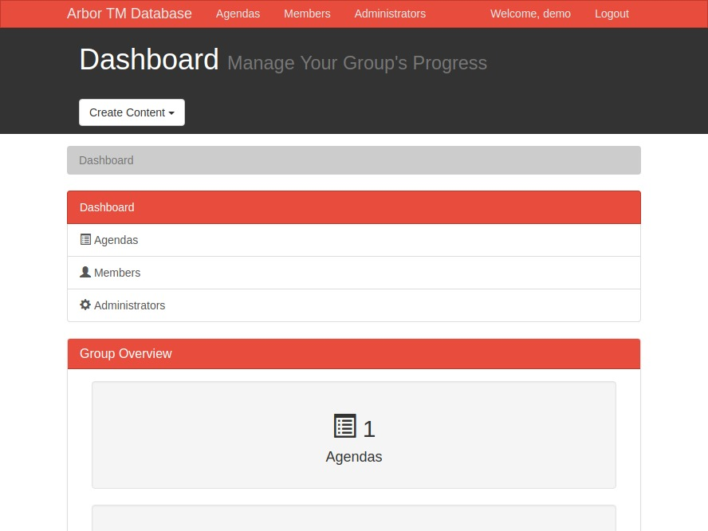

# Toasmasters Database App


## Live Demo
Click for the [Live Demo](http://onegreatapp.com/arbor-db/public)
<br>
Username: demo<br>
Password: password

## Description
PHP & MySQL CRUD application to manage a Toastmasters group agendas and members.

## Installation
Use the **createdb.sql** to create your database and tables. The file contains dummy data.

Inside the private directory create a **db_credentials.php** with your database credentials.

```PHP
<?php
  define("HOST", "localhost");
  define("USERNAME", "");
  define("PASSWORD", "");
  define("DB_NAME", "arbor");
?>

```
## Technologies
PHP, MySQL, Bootstrap 3

## Disclosure
The application was built for my educational purposes and not meant for production. Application does not perform validations and unsafe for production purposes.
